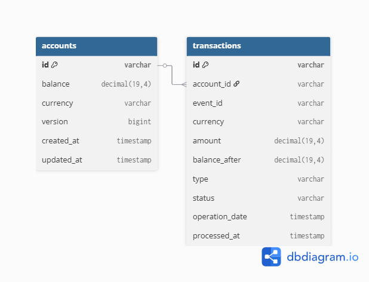
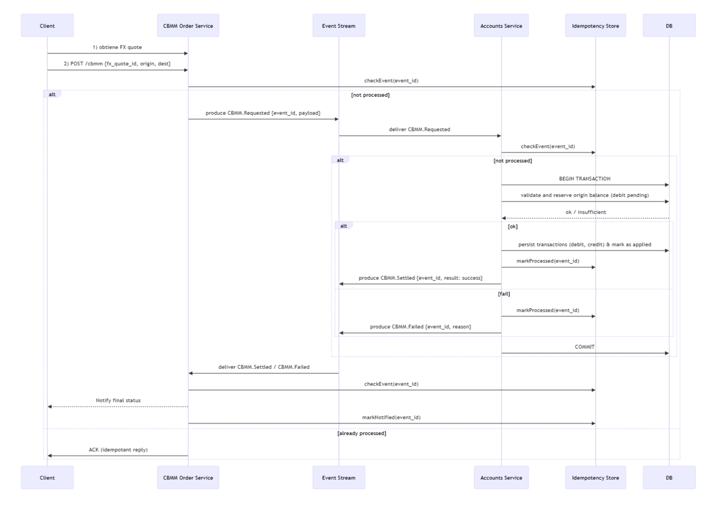
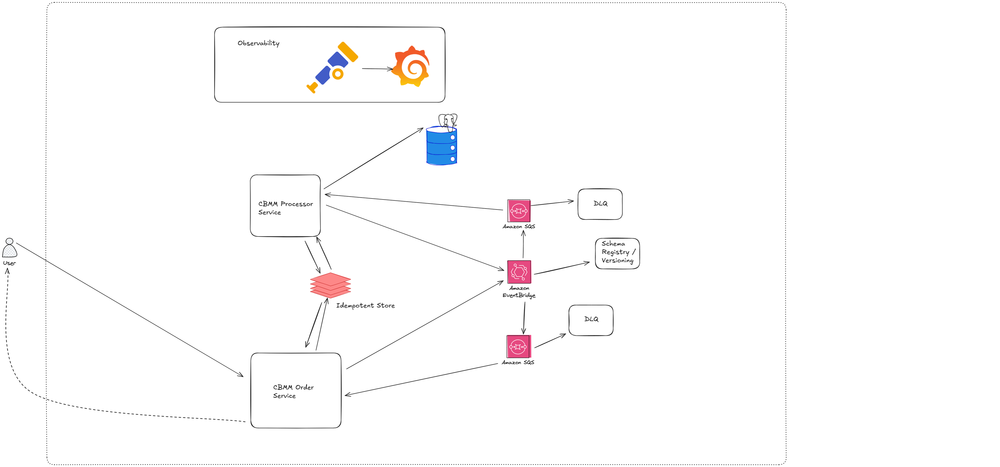
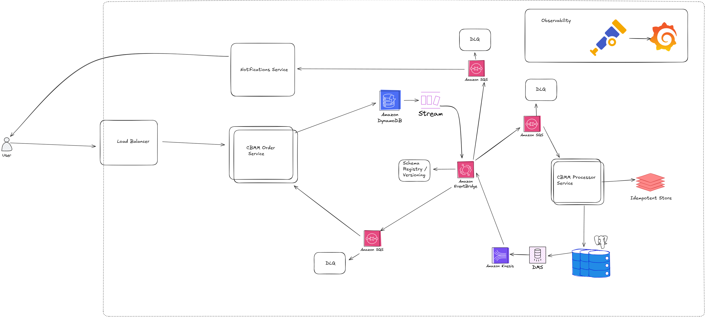
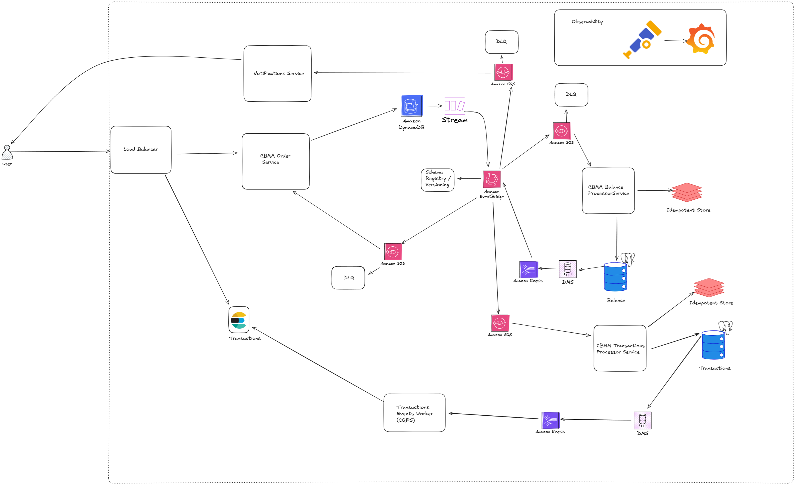

# Diseño

## Requisitos funcionales

- Un usuario debe poder realizar una transferencia de dinero 
- Un usuario debe poder ver su saldo disponible
- Un usuario debe poder ver su listado de movimientos

## Requisitos no funcionales

- Alta disponibilidad con latencia mínima.
- El sistema debe poder ser escalable y eficiente.

## Assumptions

- La autenticación se realizará por algún third-party service, ej Auth0.
- El foco del sistema en una etapa inicial se centra en manejar correctamente la transferencia
en lugar de aspirar a un alto rendimiento, es decir, la clave del sistema estará en no procesar transferencias por 
- duplicado ni dejar transacciones inconsistentes
- La solicitud de FX Quotes queda por fuera del scope


## Estimaciones

- TPD (transactions per day): 1 millón
- RPS (request per second): **1M/(24h * 3600s) = ~10**.
- Tamaño promedio de una transferencia: 250 bytes
- Storage por día: **1M * 250 bytes = ~240MB/día**

## Elección de la base de datos

Para un primer diseño, debido a la características de los datos, las relaciones que presentan entre sí y las propiedades de atomicidad y
consistencia que necesitaremos una base de datos de tipo SQL, consideraremos **PostgreSQL**.

## Modelo de datos



## Diagrama de secuencia



## Diseño inicial



- Inicialmente se proponen los siguientes componentes
    - CBMM Order Service:
        - Este servicio es el encargado de crear la orden de transferencia validando que la misma no este en curso
    - CBMM Processor Service:
        - Este servicio es el encargado de procesar las ordenes de transferencia, validando balance de la cuenta origen, 
          actualizando el balance tanto en cuenta origen como en destino y generando las correspondientes transacciones de debito y credito
    - En este diseño inicial las órdenes serán creadas en un redis, lo que nos permitirá tambien manejar la idempotencia de la misma (Set if not exist)
    - Ambos servicios pushearán logs y métricas a un collector de Open Telemetry y serán visualizadas en Grafana
    - CBMM Order Service luego de crear la orden, publica el evento en un Event Bridge
    - El evento publicado será redirigido a una SQS con su respectiva DLQ
    - CBMM Processor Service recibe el mensaje de la queue, valida en el store idempotente que la transacción no se haya procesado
    ni se este procesando, realiza la operaciones correspondientes (Credit - Debit), marca la transaccion como finalizada en el store y publica un Evento en Event Bridge
    - El evento publicado será redirigido a una SQS con su respectiva DLQ
    - CBMM Order Service recibe el mensaje de dicha queue, valida que la notificación al usuario no se haya enviado y procede a enviar la misma marcando dicha transacción con un estado de notificación enviada

## API

- `POST /api/cbmm`
    - Crea una nueva transferencia
      - Request
      - Body
        ```json
        {
          "event_id": "cbmm_20250909_000125",
          "event_type": "cross_border_money_movement",
          "operation_date": "2025-09-09T16:15:30Z",
          "origin": {
                "account_id": "ACC444444444",
                 "currency": "USD",
                 "amount": 5000.00
          },
          "destination": {
                "account_id": "ACC111111111",
                "currency": "MXN",
                "amount": 85250.00
            }
          }
    - Response
        - 201 Created

- `GET /health`
    - Retorna el estado del servidor.

## Especificacion de diseño de Eventos

- **fx.quotes** - REST; out-of-scope

- **cbmm.requested** — payload inicial con event_id, fx_quote_id, origin, destination, requested_at

- **cbmm.settled** — resultado con event_id, status: settled, applied_transactions, settled_at

- **cbmm.failed** — resultado con event_id, status: failed, reason, failed_at

- **cbmm.audit** — eventos para auditoría / archiving

## Escalabilidad del diseño

A medida que nuestro negocio escala, es necesario implementar medidas para que nuestro sistema pueda soportar la carga así como tambien ganar funcionalidad

En primer lugar podriamos partir el servicio de órdenes en 2 con el objetivo de sacarle la responsabilidad de notificar al usuario.

Se pueden agregar instancias a nuestro server y un load balancer para poder balancear la carga que tiene cada una de las mismas. Podría elegirse un algoritmo adaptativo para ajustarse a la carga actual, la capacidad del servidor, etc.

Tambien se incluye una base de datos no relacional para la gestion de órdenes reemplazando la persistencia efímera en redis.

Se elige Dynamo por su alta escalabilidad y rendimiento, para poder seguir siendo idempotentes y no procesar eventos duplicados
a pesar de la consistencia eventual de la misma, se puede optar por una estrategia de escrituras condicionales en las cuales
DynamoDB rechazará una de las operaciones si detecta que el ítem ya existe. 

En cuanto a la base de datos SQL, si bien podemos escalarla verticalmente, esto se volvería un límite eventualmente. 

Por eso, optaremos por escalar horizontalmente mediante la técnica de sharding, particionando la data en diferentes instancias. 

Para asignar a cuál instancia se guardaría un nuevo dato, podríamos usar consistent hashing para tomar la decisión.

Se implementa tambien un patrón de Change Data Capture tanto para transferencias con DMS y Kinesis para actualizar el estado de la orden generada,
como para órdenes con DynamoDBStreams, Event Bridge y Queue

Nuestro diseño inicial quedaría de la siguiente manera:



Si quisieramos escalar aún más, llevando el análisis un poco más cerca del mundo real, podríamos sacar las siguientes conclusiones:

- Partir nuestro monolito modular en diferentes microservicios. Esto permitiría usar distintas bases de datos según el caso de uso. Deberíamos primero definir los boundaries de cada dominio. Una opción sería:
    - **CBMM Order Service**: se encarga del dominio de ordenes y de su ciclo de vida (Inicio - Exito / Rechazo)
    - **CBMM Balance ProcessorService**: se encarga del dominio del balance de los usuarios 
    - **CBMM Transactions Processor Service**: se encarga del dominio de las transacciones
    - **Transactions Events Worker**: Se encarga de procesar los eventos de transacciones y persistirlos en un almacenamiento full text search

- Se podría implementar el patrón CQRS de forma de separar las escrituras de las lecturas, implementando una base de datos de tipo full text search aprovechando las bondades de la misma a la hora de presentar las transferencias (u ordenes si se deseara) al usuario.
- Se podría implementar el patron SAGA con coreografía, usando eventos apoyados en el patron CDC para poder orquestar la transacción.
- Se podría implementar un circuit breaker detectando si alguno de los componentes no está operativo a fin de notificarle al usuario que no podremos procesar su transferencia de manera inmediata y brindarle la posibilidad de programar la mismo para mas tarde

Podemos bocetar un diagrama simplificado del diseño final de la siguiente manera:



Una explicación sencilla podría ser:

- **Creación de una Transferencia**
    - Se crea una orden de transferencia en DynamoDB.
    - Se dispara un evento via DynamoDB Streams
    - Se rutea con Event Bridge al Balance Processor
    - Se realiza la operacion transaccional que afecta el balance de ambos usuarios
    - Se dispara un evento via DMS procesado por Kinesis y enviado a Event Bridge
    - Se rutea con Event Bridge al Transactions Processor
    - Se realiza la operacion transaccional que crea las transacciones de débito y crédito
    - Se dispara un evento via DMS procesado por Kinesis, que dispara persistencia en elasticsearch

## Alternativas
- En lugar de CDC se podría implementar Outbox Pattern para los eventos transaccionales
- En lugar de Event Bridge + SQS se podría utilizar Kafka